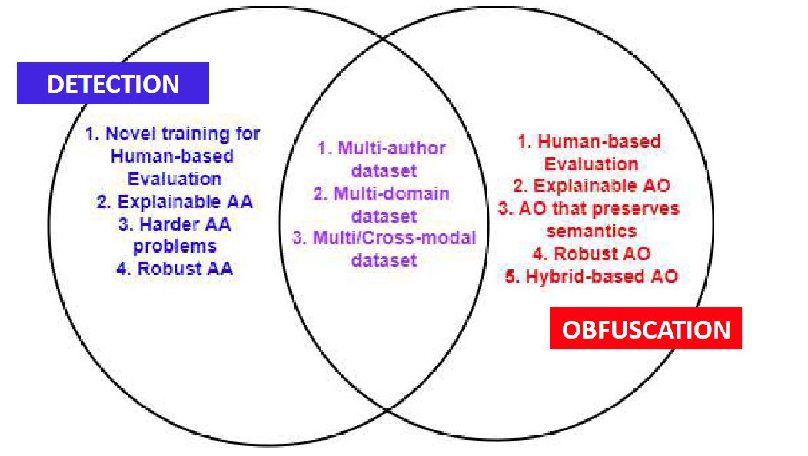

# DeepFake
Deep learning + fakes = DeepFake

深度学习和假的东西结合, 通常在两个领域: CV和NLP

# DeepFake on Text

LLM 目前在这行业挺专业的

计算概率分布: 输入 word seq, 输出概率分布在训练数据T上:

P(“what a wonderful world” | T) = 0.35

P(”what a wonderful pig” | T) = 0.02

LLM几个缺点:

- Mermorization: 会记得所有训练数据, 泄露隐私
- Plagiarism: 会从训练数据中抄袭, 或者做很少的更改
- Bias: 就是偏见, 美国人是白的, 中国人是黄的
- Toxicity: 会生成仇恨, 坏的
- Hallucination (幻觉): 会生成假的东西, 很多是对了但对了一半的

# 2 Critical Tasks of Deepfake Texts
1. 去 detect 是否是deepfake
2. 去 defend deepfake, 让假的看不出来

# detector 分类

## Stylometric Attribution 语体分类
根据文本风格的统计分析办法, 只根据写作风格, 作者就可以被识别出来

Linguistic Model 语言模型: 给定一些authors, 根据他们的LIWC做个分类器

Linguistic Inquiry & Word Count (LIWC) 语言查询和词频统计: 有93种特征, 其中69种被归纳入如下的4类: 
- Standard Linguistic Dimensions 标准语言维度, 如: pronouns. 
- Psychological Processes 心理过程, 如: affect, cognition, biological processes.
- Personal concerns 个人关注, 如: work, leisure, home, money, religion.
- Spoken Categories 口语类别, 如: assent (赞同), nonfluencies (不流畅), fillers (填充词), swear words (脏话).

可读性分数: 使用vocabulary去提取作者的等级

Entropy 熵: 用于衡量不确定和不平衡度 surprisal , 低概率事件 = 高不平衡 = 高信息, 常见的方式就是数不同的字符

熵的计算法: 

几种语言模型: 
1. LIWC-Article: 使用 a an the 来做区分
2. LIWC-Analytic: 使用 形式和逻辑 做区分
3. LIWC-Authentic: 用实诚的词做区分

## Deep learning-based Attribution 主要是 Transformer
常用的模型: BERT, RoBERTa, DistilBERT, ELECTRA

OpenAI 用的 RoBERTa, 做GPT2 detector

GROVER detect

## Statistical-based Attribution 统计办法
使用文本的概率分布作为 feature 去做分类器的办法

GLTR: 1. 计算每个word的概率; 2. 计算每个word的绝对rank; 3. 计算预测分布的熵即可

DetectGPT: 扰动文本, 统计log-likelihood的变化, 根据统计结果, 稳定的是MGT

## Hybrid Attribution 混合办法
FAST: 使用 RoBERTa 计算 Embedings, 再使用 NER 把图建起来, 全丢进 GNN, 预测

## Human Attribution 人工办法
使用人工检查, 但是需要训练:

注意4点: 1. Repetition 会重复很多文本; 2. Factuality 事实是不对的 3.  Grammar and spelling: errors 会少; 4. Style: AI mimic style, 看着特别像话的有问题

使用 example-based 的办法, 判断时候, 给个例子, 效果有提升

人工验证效果一般

## Framework
使用 crowd annotation 大量标准, 并解释哪里不对

在框架下, 有3种不对的情况: 

## 常见 Detector

# Obfuscation 模糊
目的: 让 MGT 没有办法被 detect, 在 preserving semantics 的同时, making small changes to the text

做到最小的改变, 并保留作者身份 authorship
   
模糊和detect一样, 两种大方向: stylometric 文体本身 和 statistical 统计办法

stylometric 又有4种办法:

1. lexical 词汇办法: 改变词, 但是保留词性, 不同的同义词 show -> indicate
2. Syntactic 语法办法: 改变语法, 但是保留语义, 不同的语序 show -> be shown
3. Morphological 形态办法: 改变词性, 但是保留词意, 不同的词性 well -> good
4. Orthographic 正体办法: 改变标点符号 Punctuation, 不同的符号: . -> !

## Taxonomy 分类模糊办法
Indirect Obfuscation 间接模糊: 直接使用模糊器

Direct Obfuscation 直接模糊: 模糊器和目标模型进行几次概率测试, 选择最好的文本

Transferable Obfuscation 迁移模糊: 模糊器和其他的模型进行几次概率测试, 选择最好的文本

## stylometric obfuscation 文体模糊
几种办法: 

PAN: 

Apply text transformations (e.g., remove stop words, inserting punctuations, lower case) to push statistical metrics of each sentence closer to those of the corpus average. 应用文本转换(例如, 删除停用词, 插入标点符号, 小写)将每个句子的统计指标推向语料库平均值

Mutant-X: 

Replacing words with neighboring words via sentiment-specific word embeddings (customized word2vec) 把词替换成邻近的词, 通过情感特定的词嵌入, 就是替换为Embedding相近的词

该方法使用了 进化计算的办法, 直到 authorship changes 且 semantic preserves

Avengers: 

在迁移模糊的基础上, 最后判断的时候采用多种模型来 avenger, 提高了迁移效果

DFTFooler: 

不用别的模型, 不需要请求detector, 直接在生成模型中, 把置信高的词替换成置信低的同义词, 完事

Mikhail: 

1. 使用一个detector, 让detector选出最像人写的文本, 然后直接用detector的结果生成
2. 在使用 beam search 找下一个词儿的时候, 用 detector 的结果作为额外的信号

Changing decoding strategy:

改变 decode 策略, 如果生成器和检测器的解码策略不一样, 会降低效果

## 结论

检测和模糊的交集: 多作者数据集, 多领域数据集, 多模态数据集

未来方向: 水印, 对人眼不可见, 但是算法可见

